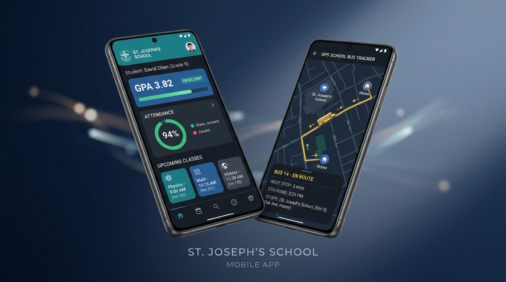
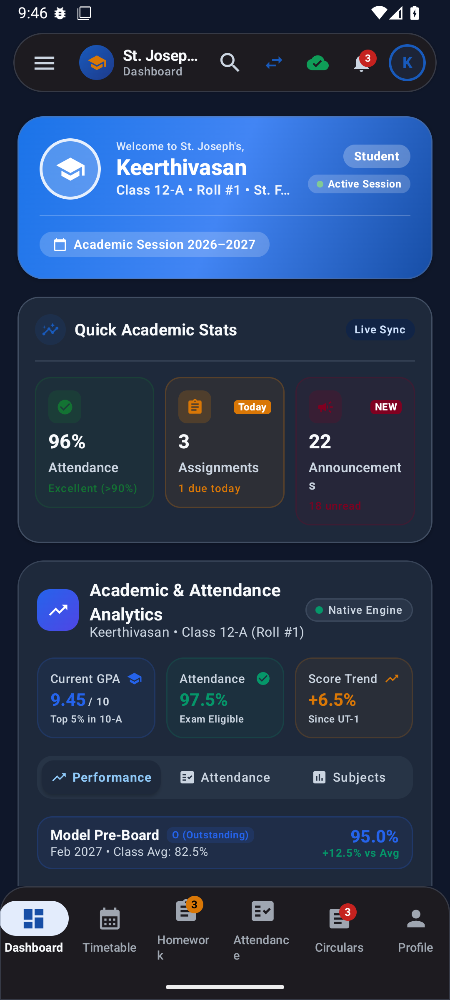
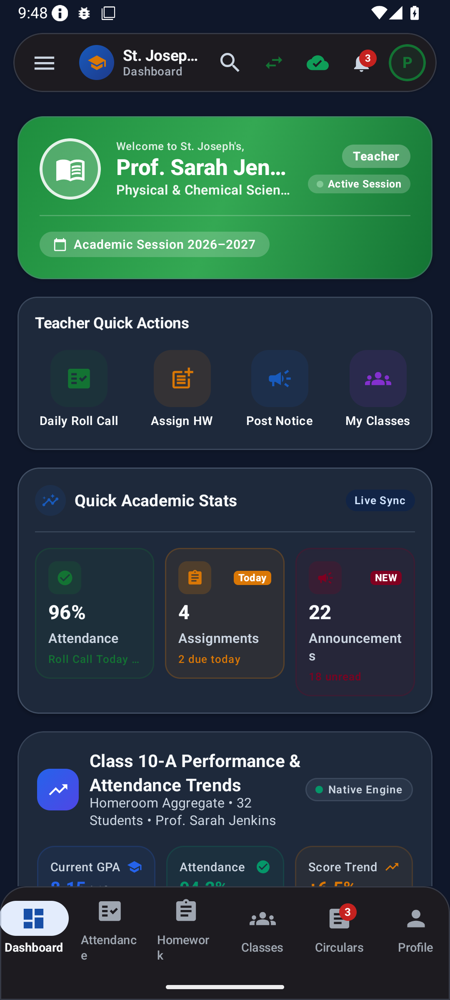
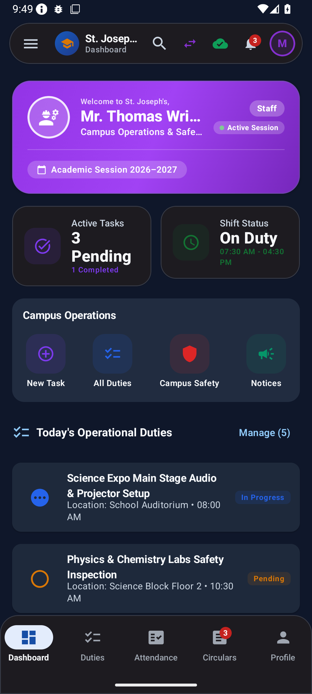
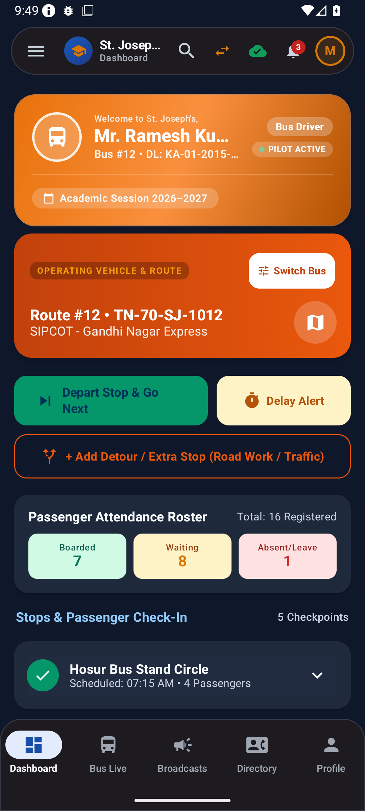
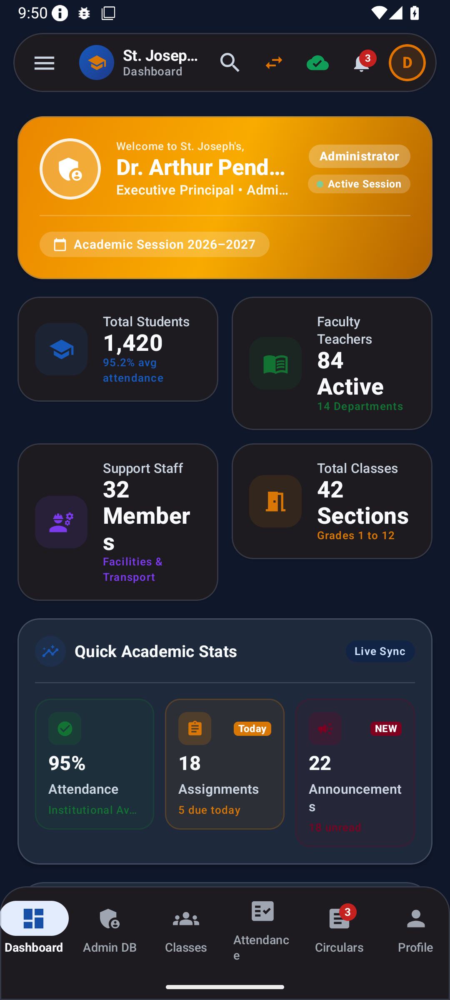
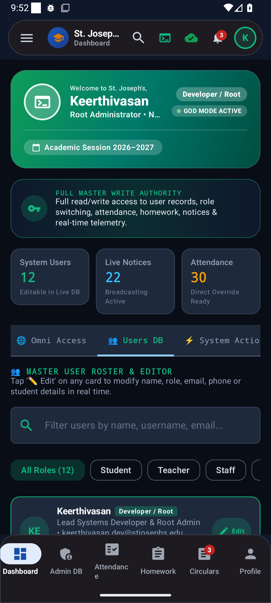
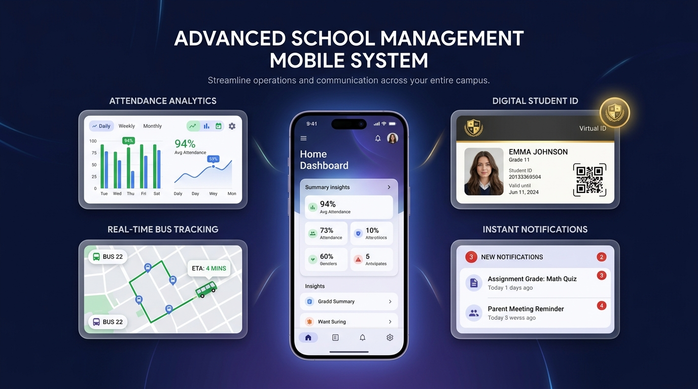

<div align="center">

  

  # St. Joseph's Connected Campus
  ### The Next-Generation Native Android Institutional Operating System

  *Empowering Academics, Operations, and Transit with Precision Engineering*

  <p align="center">
    <a href="https://github.com/2009skvgamerz/School-project-application-/releases"></a>
    <a href="https://developer.android.com/about/versions/15"></a>
    <a href="https://developer.android.com/jetpack/compose"></a>
    <a href="https://kotlinlang.org"></a>
    <a href="https://developer.android.com/training/data-storage/room"></a>
    <a href="https://firebase.google.com"></a>
  </p>

  <br />

  

</div>

<br />

---

## 🌟 Executive Overview

**St. Joseph's Connected Campus** is a flagship enterprise mobile platform purpose-built for **St. Joseph Matriculation Higher Secondary School** (*Hosur, Tamil Nadu*). 

Engineered from the ground up with **Kotlin 2.0** and **Jetpack Compose (Material Design 3)**, the platform replaces fragmented legacy school software with a unified, role-aware institutional operating system. Whether it is an instant morning roll call, real-time GPS fleet tracking of school buses, dynamic academic analytics, or instant push broadcasting, St. Joseph's Connected Campus delivers sub-second responsiveness with **100% offline-first reliability**.

---

## 🏛️ 6 Purpose-Built Role Ecosystems

Every user profile is greeted by a custom-crafted interface designed strictly for their daily operational workflow:

<div align="center">

| 👨‍🎓 **Student Experience** | 👩‍🏫 **Faculty & Teacher Suite** |
| :---: | :---: |
|  |  |
| *Academic GPA analytics, digital ID badge, daily period timetable, and instant homework submission tracking.* | *One-tap batch roll-call attendance, class performance trackers, assignment publishing, and syllabus pacing.* |

<br />

| 🛠️ **Campus Operations** | 🚍 **Live Transit & Fleet Radar** |
| :---: | :---: |
|  |  |
| *Facility shift schedules, campus duty checklists, infrastructure maintenance logging, and staff directory.* | *Real-time route telemetry, stop-by-stop passenger check-ins, delay broadcasts, and direct turn-by-turn navigation.* |

<br />

| 👑 **Executive Administration** | 💻 **Systems & Developer Hub** |
| :---: | :---: |
|  |  |
| *Institutional strength KPIs, tuition fee collection tracking, school-wide circular authoring, and executive governance.* | *Real-time SQLite database inspection, live sync telemetry, omni-role switcher, and system cache controls.* |

</div>

---

## 🚀 Key Technological Innovations

<div align="center">
  
</div>

### 1. ⚡ Offline-First Architecture with SQLite Room Cache
- **Instantaneous Cold-Start**: Zero network lag on startup. User dashboards, class schedules, and identity cards hydrate in milliseconds from the local Room database (`AppDatabase`).
- **Resilient Background Synchronization**: Integrated `WorkManager` and `SchoolBackgroundSyncWorker` automatically queue offline transactions and synchronize seamlessly once network connectivity is restored.

### 2. 🚍 Real-Time In-App Fleet & Bus Radar
- **Live Cartography**: Embedded OpenStreetMap & Esri satellite mapping engine with custom route polylines and smooth bus pin animation.
- **Proximity Telemetry**: Live speed calculation, next-stop ETA countdowns, and student boarding checklists for morning and evening pickup routes across Hosur.
- **Instant Google Navigation Launch**: One-touch intent launch into native Google Maps turn-by-turn driving mode for drivers.

### 3. 🔔 Continuous Autonomous Alert Engine
- **Independent System Alarms**: Configured with Android `AlarmManager` (`setExactAndAllowWhileIdle`) to ensure critical updates (bus proximity, homework deadlines, emergency notices) fire precisely even when the device is in deep Doze mode or the app process is terminated.
- **Firebase Cloud Messaging (FCM)**: Native `SchoolFirebaseMessagingService` with multi-channel subscription topics (`#all_school`, `#announcements`, `#exams`, `#sports`).

### 4. 🪪 High-Security Digital Smart Badges
- **Cryptographic Barcode & QR**: High-contrast, scannable digital student and faculty ID cards embedded with student roll numbers, blood group, emergency contacts, and institutional house insignias.
- **Seamless Alpha Transparency**: True alpha-channel crest rendering across both dark and light modes.

---

## 🏗️ Technical Architecture & Engineering Stack

```
┌──────────────────────────────────────────────────────────────────────────┐
│                     Jetpack Compose UI (Material 3)                      │
│     (Floating Search Pill • Role Dashboards • Interactive Cards)         │
└────────────────────────────────────┬─────────────────────────────────────┘
                                     │ Reactive StateFlow
                                     ▼
┌──────────────────────────────────────────────────────────────────────────┐
│                   State Management & ViewModel Layer                     │
│           (SchoolViewModel • AuthenticationViewModel)                    │
└────────────────────────────────────┬─────────────────────────────────────┘
                                     │ Repository Orchestration
                                     ▼
┌──────────────────────────────────────────────────────────────────────────┐
│                   Domain Repository & Sync Services                      │
│            (SchoolRepository • BackgroundSyncManager)                    │
└───────────────────┬──────────────────────────────────┬───────────────────┘
                    │                                  │
                    ▼ Local Storage                    ▼ Remote & System
┌──────────────────────────────────────┐  ┌────────────────────────────────┐
│         Android Room SQLite          │  │    AlarmManager & Firebase     │
│   (DAOs • TypeConverters • KSP)      │  │ (SchoolAlarmReceiver • FCM)    │
└──────────────────────────────────────┘  └────────────────────────────────┘
```

| Layer | Framework / Component | Technical Role |
| :--- | :--- | :--- |
| **Language** | Kotlin 2.0 | Modern coroutines, Flow streams, sealed state hierarchies |
| **UI Kit** | Jetpack Compose (M3) | Declarative UI, dynamic tonal color theming, edge-to-edge system insets |
| **Local Storage** | Android Room DB | Local persistence, schema versioning, and zero-latency caching |
| **Fleet Radar** | Leaflet Cartography & WebKit | Hardware-accelerated interactive maps with Street, Satellite, & Dark layers |
| **Push Engine** | Firebase Cloud Messaging (FCM) | Priority heads-up push notifications with deep-link navigation |
| **Background Sync** | Android WorkManager & AlarmManager | Exact alarm scheduling, boot recovery, and background network sync |

---

## 👥 Instant Access Demo Accounts

The application includes pre-configured demo profiles to explore each operational role immediately:

> 🔑 **Standard Prototype Password:** `password123`

| Role | Username | Display Name | Assignment / Scope |
| :--- | :--- | :--- | :--- |
| 👨‍🎓 **Student** | `student01` | **Keerthivasan** | Class 12-A • Roll #1 • St. Francis House |
| 👩‍🏫 **Teacher** | `teacher01` | **Prof. Sarah Jenkins** | Class 10-A Homeroom • Dept of Physics |
| 🛠️ **Staff (Operations)** | `staff01` | **Mr. Thomas Wright** | Campus Safety & Facility Supervisor |
| 🚍 **Staff (Driver)** | `driver01` | **Mr. Ramesh Kumar** | Fleet Pilot • Route #12 (SIPCOT Express) |
| 👑 **Administrator** | `admin01` | **Dr. Arthur Pendelton** | Principal & Executive Head of Institution |
| 💻 **Developer** | `root01` | **Keerthivasan** | Systems Architect • God-Mode Access |

*Tip: Tap any role icon on the login screen or use the profile switcher to instantly preview any role's customized dashboard.*

---

## 🛠️ Build & Installation

### Option 1: Direct APK Download
Grab the pre-compiled production APK from the [**GitHub Releases Tab**](https://github.com/2009skvgamerz/School-project-application-/releases) and install directly on any Android device running **Android 7.0 (API 24) or higher**.

### Option 2: Build from Source
1. **Clone the Repository**:
   ```bash
   git clone https://github.com/2009skvgamerz/School-project-application-.git
   cd School-project-application-
   ```
2. **Open in Android Studio** (Ladybug / Koala / Meerkat recommended).
3. **Build Debug or Release APK**:
   ```bash
   gradle assembleDebug
   ```
4. **Deploy**: Connect an Android device with USB Debugging enabled and run via Android Studio or `adb install`.

---

## 🏛️ Institutional Information

<div align="center">

**St. Joseph Matriculation Higher Secondary School**  
*Motto: "Shine and Let Shine"*  
📍 SIPCOT, Gandhi Nagar Road, Mookondapalli, Hosur, Tamil Nadu 635126  
📞 +91 4344 276544 &nbsp;|&nbsp; ✉️ info@stjosephshosur.edu.in  

<br />

<sub>Designed and developed for excellence in modern institutional digital governance. Powered by Google AI Studio.</sub>

</div>
