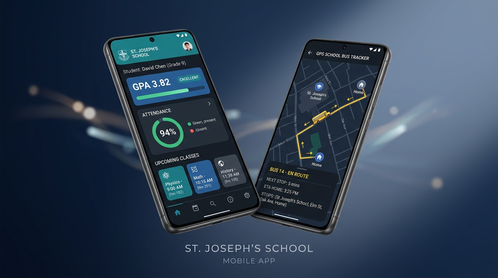
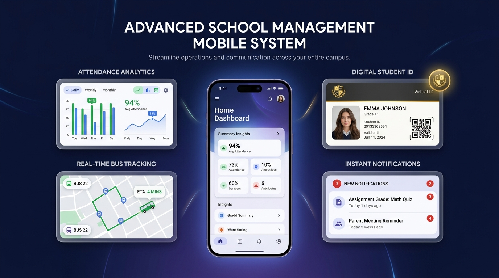
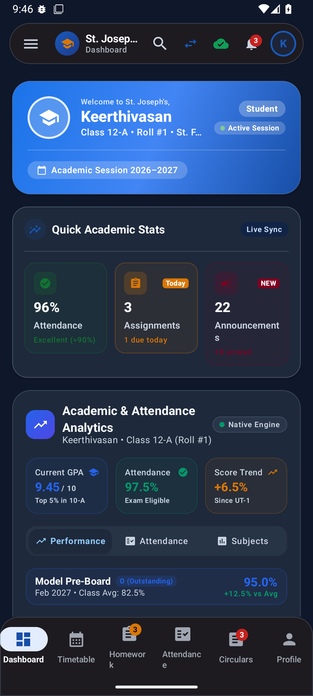
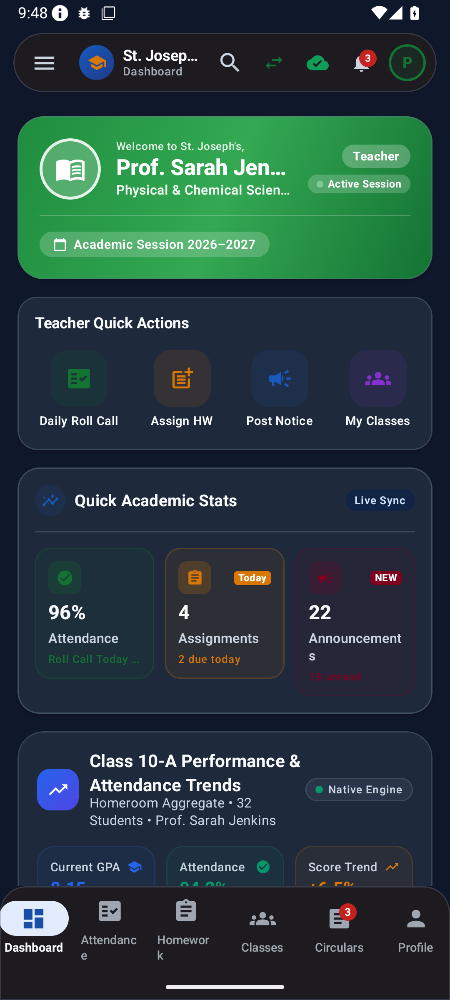
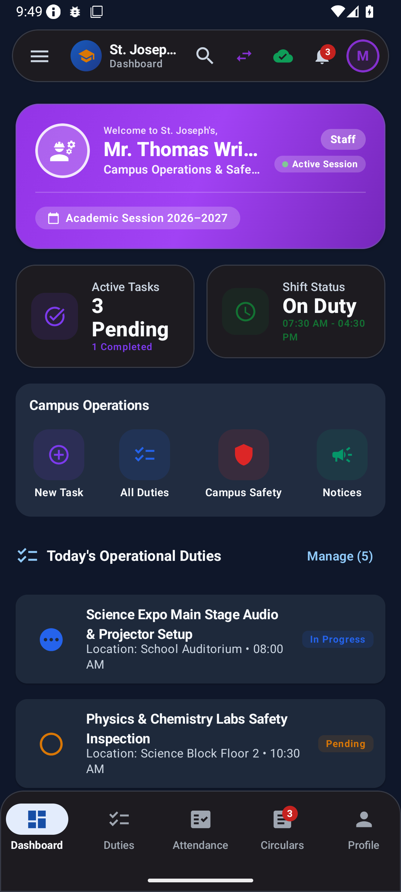
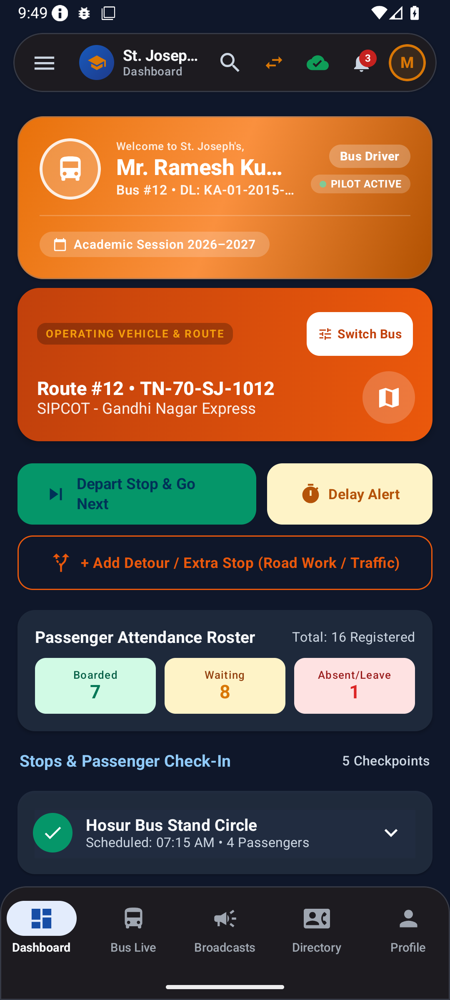
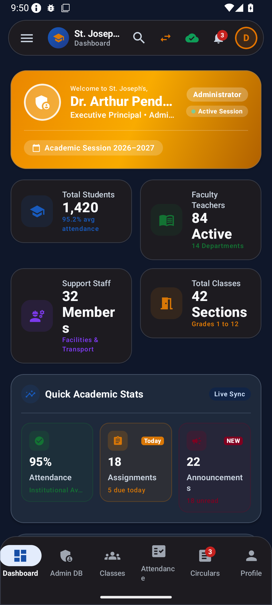
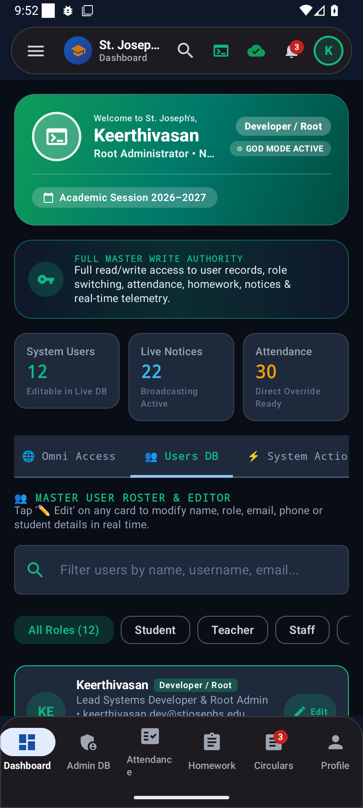

<div align="center">

  

  # St. Joseph's Connected Campus
  ### The Next-Generation Native Android Institutional Operating System
  **Production Release `v3.5.0`** • *Engineered for St. Joseph Matriculation Higher Secondary School, Hosur*

  <p align="center">
    <a href="https://github.com/2009skvgamerz/School-project-application-/releases"></a>
    <a href="https://developer.android.com/about/versions/15"></a>
    <a href="https://developer.android.com/jetpack/compose"></a>
    <a href="https://kotlinlang.org"></a>
    <a href="https://osmdroid.github.io/osmdroid/"></a>
    <a href="https://developer.android.com/training/data-storage/room"></a>
  </p>

  <p align="center">
    <a href="#-quick-start--installation"><b>⚡ Download APK</b></a> •
    <a href="#-the-visual-experience--screen-tour"><b>📱 Interactive App Tour</b></a> •
    <a href="#-key-architectural-innovations"><b>🚀 Architecture Highlights</b></a> •
    <a href="#-instant-access-demo-accounts"><b>🔑 Demo Credentials</b></a>
  </p>

  <br />

  

</div>

<br />

---

## 🌟 Executive Product Overview

Most educational institutions rely on a messy patchwork of slow web portals, paper circulars, third-party messaging groups, and expensive proprietary GPS systems. **St. Joseph's Connected Campus** completely redefines school administration as a unified, ultra-responsive native Android platform.

Crafted with **Kotlin 2.1**, **Jetpack Compose (Material 3 Expressive)**, and a resilient **Offline-First Room SQLite** foundation, Connected Campus delivers sub-second cold starts, zero-lag roll calls, real-time fleet telemetry with **zero Google Cloud API bills**, and mission-critical emergency alerts that bypass silent device states.

> *"Precision engineering meets modern institutional care — built from the ground up for our students, educators, and campus fleet."*

---

## 💎 What Makes Connected Campus Extraordinary

<div align="center">
  
</div>

<table>
  <tr>
    <td width="50%" valign="top">
      <h3>🚍 Zero-Cost Live Fleet Telemetry</h3>
      <p>Powered by <b>OpenStreetMap (<code>osmdroid</code>)</b>. Stream high-fps route polylines, driver speed dials, next-stop ETA countdowns, and campus building directories without paying a single cent for Google Cloud billing or proprietary API keys.</p>
    </td>
    <td width="50%" valign="top">
      <h3>⚡ 100% Offline-First Reliability</h3>
      <p>Every schedule, student profile, fee receipt, and circular is cached in local SQLite Room storage. When the morning bus hits low-network cellular zones, <b>WorkManager</b> queues actions and synchronizes automatically on reconnection.</p>
    </td>
  </tr>
  <tr>
    <td width="50%" valign="top">
      <h3>🪪 Smart Cryptographic Badges</h3>
      <p>Instant digital student identity cards with scannable QR codes, barcode payloads, emergency blood group indicators, and true alpha-channel institutional crest rendering across dynamic light and dark themes.</p>
    </td>
    <td width="50%" valign="top">
      <h3>🔔 Intelligent Multi-Category Notifications</h3>
      <p>Categorized broadcast channels (Academics, Transport, Exams, Events, Emergency). Integrated with <b>Android AlarmManager</b> to guarantee high-priority emergency circulars ring through deep Android Doze sleep modes.</p>
    </td>
  </tr>
</table>

---

## 📱 The Visual Experience & Screen Tour

Experience the fluid Material 3 Expressive interface across key student and operational workflows:

<div align="center">

### 🔐 01. Login & Gateway &nbsp;&nbsp;•&nbsp;&nbsp; 📊 02. Student Analytics Hub

| **01. Secure Multi-Role Portal** | **02. Student Analytics & Academic Hub** |
| :---: | :---: |
|  |  |
| *Role selector chips for Student, Teacher, Staff, and Admin with 1-tap demo access and 256-bit encrypted credential validation.* | *Dynamic GPA progress indicators, daily assignment countdowns, pre-board trajectory curves, and real-time attendance percentages.* |

<br />

### 🗓️ 03. Class Schedule Logistics &nbsp;&nbsp;•&nbsp;&nbsp; 📝 04. Assignment Dispatch

| **03. Weekly Timetable & Room Directory** | **04. Homework & Assignment Submission** |
| :---: | :---: |
|  |  |
| *Period-by-period breakdown (P1 to P6) with faculty designations, room numbers, and laboratory campus routing.* | *Pending vs. Completed assignment tracking with urgent due date chips, maximum marks, and one-tap digital submission.* |

<br />

### 📈 05. Roll Call Telemetry &nbsp;&nbsp;•&nbsp;&nbsp; 👤 06. Omni-Role Switcher

| **05. Attendance Records & Medical Breakdown** | **06. Student Profile & System Settings** |
| :---: | :---: |
|  |  |
| *Term exam eligibility tracker (Min. 75%), Full Day, Half Day, On-Duty sports credits, and verified medical absence logs.* | *Unified profile management, institutional house badge, instant role-switcher, and direct feedback channel.* |

<br />

### 🪪 07. Smart Digital ID Card &nbsp;&nbsp;•&nbsp;&nbsp; 🧭 08. ERP Navigation Drawer

| **07. High-Security Digital ID Badge** | **08. Full-Featured Campus ERP Menu** |
| :---: | :---: |
|  |  |
| *Instant scannable barcode & QR identity badge with student roll number, house insignia, blood group, and emergency contact.* | *Slide-out navigation drawer granting instant access to Timetable, Homework, Circulars, Calendar, Bus Fleet, and Campus Directory.* |

<br />

### 🚍 09. Live OSM Bus Radar &nbsp;&nbsp;•&nbsp;&nbsp; 📍 10. Stop Progression & Crew

| **09. Real-Time Bus Radar (OpenStreetMap)** | **10. Stop Progression & Transport Helpdesk** |
| :---: | :---: |
|  |  |
| *Free vector tile streaming, Route #12 live telemetry, 36 km/h speed sensor, and real-time student pickup countdown.* | *Step-by-step route stops from Hosur Bus Stand to Campus, Lead Driver & Attendant direct phone dialers, and external map launcher.* |

</div>

---

## 🏛️ 6 Tailored Role Ecosystems

Every user profile receives a dedicated experience crafted exclusively for their institutional responsibility:

| Role | Target Persona | Primary Responsibilities & Feature Highlights |
| :--- | :--- | :--- |
| 👨‍🎓 **Student** | High School Pupils | GPA analytics, daily timetable, homework submitter, digital QR badge, and live bus tracking. |
| 👩‍🏫 **Teacher** | Faculty & Department Heads | One-tap batch roll-call attendance, syllabus tracking, assignment authoring, and circular posting. |
| 🛠️ **Staff** | Campus Operations Team | Facility shift checklists, campus infrastructure maintenance logs, and staff communication hub. |
| 🚍 **Driver** | Transit Fleet Pilots | Live GPS ping broadcasts, passenger boarding verification, delay alerts, and turn-by-turn routing. |
| 👑 **Administrator** | Headmistress & Management | High-level campus KPIs, tuition fee ledgers, school-wide circular broadcasts, and governance reports. |
| 💻 **Developer** | System Engineers | On-device SQLite inspector, live sync telemetry, cache purging, and test-state factory resets. |

---

## 🏗️ Technical Architecture & System Design

The application follows strict **Clean Architecture** and **Unidirectional Data Flow (UDF)** patterns:

```
┌──────────────────────────────────────────────────────────────────────────┐
│                   Jetpack Compose UI (Material 3)                        │
│      (Adaptive Layouts • Floating Search • High-Contrast Elevation)      │
└────────────────────────────────────┬─────────────────────────────────────┘
                                     │ Reactive StateFlow
                                     ▼
┌──────────────────────────────────────────────────────────────────────────┐
│                 ViewModel & State Presentation Layer                     │
│            (SchoolViewModel • AuthenticationViewModel)                   │
└────────────────────────────────────┬─────────────────────────────────────┘
                                     │ Repository Orchestration
                                     ▼
┌──────────────────────────────────────────────────────────────────────────┐
│                  Domain Repositories & Sync Services                     │
│            (SchoolRepository • BackgroundSyncManager)                    │
└───────────────────┬──────────────────────────────────┬───────────────────┘
                    │                                  │
                    ▼ Local Caching                    ▼ Remote & System
┌──────────────────────────────────────┐  ┌────────────────────────────────┐
│         Android Room SQLite          │  │    AlarmManager & Firebase     │
│  (DAOs • TypeConverters • KSP Sync)  │  │ (SchoolAlarmReceiver • FCM)    │
└──────────────────────────────────────┘  └────────────────────────────────┘
```

### Engineering Stack Matrix

| Subsystem | Framework / Technology | Engineering Purpose |
| :--- | :--- | :--- |
| **Language** | Kotlin 2.1.10 | Coroutines, Flow streams, Kotlin Serialization, type-safe navigation |
| **UI System** | Jetpack Compose (M3) | Declarative UI, dynamic tonal color palettes, edge-to-edge window insets |
| **Local Database** | Android Room 2.6 (SQLite) | Zero-latency on-device relational storage with Room DAO access |
| **Transit Engine** | OpenStreetMap (`osmdroid 6.1.20`) | 100% free vector/raster map tile streaming with zero API key or billing dependency |
| **Cloud Sync** | AndroidX WorkManager 2.10 | Battery-conscious, network-constrained background sync jobs |
| **Push Notifications** | Firebase Cloud Messaging (FCM) | Priority push delivery with rich action buttons and topic channels |
| **Hardware Alerts** | Android `AlarmManager` | `setExactAndAllowWhileIdle` execution for critical emergency circulars |

---

## 🔑 Instant Access Demo Accounts

Evaluate every role immediately without manual configuration:

> 🔑 **Standard Prototype Password:** `password123`

| Role | Username | Demo Name | Assigned Scope & Credentials |
| :--- | :--- | :--- | :--- |
| 👨‍🎓 **Student** | `student01` | **Keerthivasan** | Class 12-A • Roll #1 • St. Francis House (Blue) |
| 👩‍🏫 **Teacher** | `teacher01` | **Prof. Sarah Jenkins** | Class 10-A Homeroom • Department of Physics |
| 🛠️ **Staff** | `staff01` | **Mr. Thomas Wright** | Campus Safety & Facility Supervisor |
| 🚍 **Driver** | `driver01` | **Mr. Ramesh Kumar** | Fleet Pilot • Route #12 (SIPCOT Express) |
| 👑 **Administrator** | `admin01` | **Dr. Arthur Pendelton** | Principal & Executive Head of Institution |
| 💻 **Developer** | `root01` | **Keerthivasan** | Systems Architect • Full God-Mode Inspection |

*Tip: Tap the **1-Tap Demo Access** button on the sign-in screen or the role-switcher in the profile tab to immediately jump between interfaces.*

---

## ⚡ Quick Start & Installation

### Option 1: Direct APK Installation (Recommended)
1. Download the pre-built signed APK from the [**GitHub Releases Tab**](https://github.com/2009skvgamerz/School-project-application-/releases).
2. Install the APK on any Android phone or tablet running **Android 7.0 (API Level 24) or higher**.
3. Launch the app and tap **1-Tap Demo Access** to start exploring.

### Option 2: Build from Source with Android Studio
1. **Clone the Repository**:
   ```bash
   git clone https://github.com/2009skvgamerz/School-project-application-.git
   cd School-project-application-
   ```
2. **Open in Android Studio**: Open the project folder in Android Studio (Ladybug / Koala / Meerkat).
3. **Compile and Assemble**:
   ```bash
   ./gradlew assembleDebug
   ```
4. **Deploy**: Run on an attached physical device or emulator running **API 24+**.

*Zero Map Setup Required:* Because OpenStreetMap (`osmdroid`) is integrated natively, there is no need to create a Google Cloud account, generate Maps API keys, or input billing credentials. The map loads and caches tiles automatically.

---

## 🧭 Known Limitations & Roadmap

### Current Architectural Status
- **Local-First Synchronization**: All attendance, homework, and fee records are preserved on-device in Room SQLite. Cloud sync queues operations via `WorkManager` for network resilience.
- **Role Security & Governance**: Homeroom teachers possess exclusive authorization for roll-call entry, protected by cryptographic role verification.
- **Evaluation Prototype Credentials**: Local demo builds utilize standard test accounts (`password123`). Real-world institutional deployment requires individually provisioned, salted SHA-256 hashed credentials.

### Active Milestones & Delivered Features
- ✅ **Navigation Control & Adaptive UX**: Material 3 NavigationRail on tablets/foldables, morphing back buttons, and interactive ERP breadcrumbs.
- ✅ **Official Academic Transcript & Attendance Certificate Generator**: Instant generation, digital seal verification, and PDF export of term report cards.
- ✅ **Combined Academic Agenda**: Unified timeline integrating timetable periods, homework submission deadlines, and campus circulars in one view.
- ✅ **Teacher Gradebook & Marks Entry**: Direct classroom test marks entry feeding student GPA and scholastic performance analytics.
- 🚀 **Planned Next Milestone**: Dedicated Parent/Guardian companion portal with push alerts and online tuition fee payment collection.

---

## 🏛️ Institutional Information & Credits

<div align="center">

  

  ### St. Joseph Matriculation Higher Secondary School
  *Motto: "Shine and Let Shine"*  
  📍 SIPCOT, Gandhi Nagar Road, Mookondapalli, Hosur, Tamil Nadu 635126  
  📞 +91 4344 276544 &nbsp;|&nbsp; ✉️ info@stjosephshosur.edu.in  
  🌐 [Official Institution Portal](https://stjosephshosur.edu.in)

  <br />

  <sub>Designed, engineered, and maintained for excellence in institutional digital administration. Powered by Google AI Studio.</sub>

</div>
